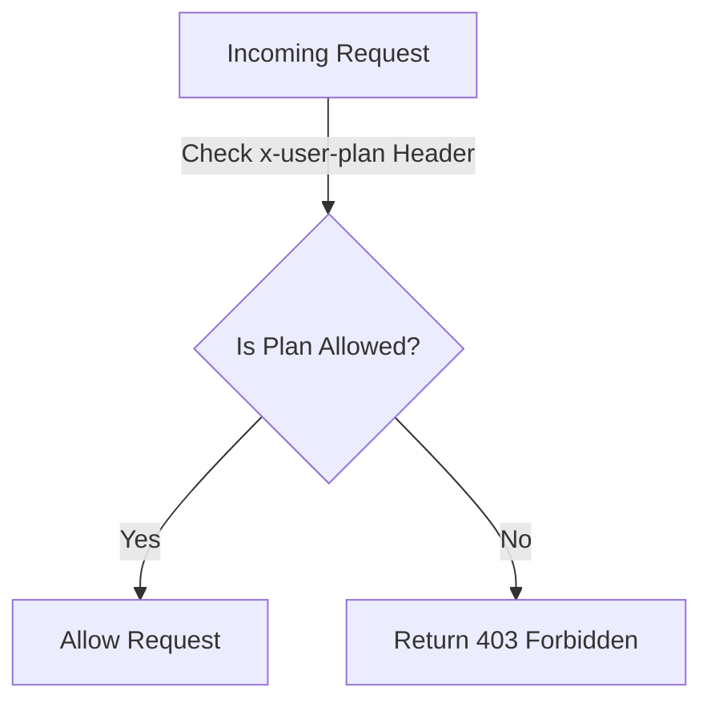

<p align="center">
  <a href="http://nestjs.com/" target="blank"></a>
</p>

[circleci-image]: https://img.shields.io/circleci/build/github/nestjs/nest/master?token=abc123def456
[circleci-url]: https://circleci.com/gh/nestjs/nest

  <p align="center">A progressive <a href="http://nodejs.org" target="_blank">Node.js</a> framework for building efficient and scalable server-side applications.</p>
    <p align="center">
<a href="https://www.npmjs.com/~nestjscore" target="_blank"></a>
<a href="https://www.npmjs.com/~nestjscore" target="_blank"></a>
<a href="https://www.npmjs.com/~nestjscore" target="_blank"></a>
<a href="https://circleci.com/gh/nestjs/nest" target="_blank"></a>
<a href="https://coveralls.io/github/nestjs/nest?branch=master" target="_blank"></a>
<a href="https://discord.gg/G7Qnnhy" target="_blank"></a>
<a href="https://opencollective.com/nest#backer" target="_blank"></a>
<a href="https://opencollective.com/nest#sponsor" target="_blank"></a>
  <a href="https://paypal.me/kamilmysliwiec" target="_blank"></a>
    <a href="https://opencollective.com/nest#sponsor"  target="_blank"></a>
  <a href="https://twitter.com/nestframework" target="_blank"></a>
</p>
  <!--[](https://opencollective.com/nest#backer)
  [](https://opencollective.com/nest#sponsor)-->

## Description

Example repository used as a guide for my [How to Test NestJS Guards](https://dev.to/thiagomini/how-to-test-nestjs-guards-55ma) article.

Its goal is to provide examples on how to create unit, integration and e2e tests for [NestJS Guards](https://docs.nestjs.com/guards), discussing the pros and cons of each type of test.

## Domain

The example domain is a SaaS for AI-Powered Content Generation called "WordWiz".

"WordWiz" helps users generate high-quality marketing content, blog posts, and social media captions using AI. However, the level of access depends on the user's subscription tier:

- **Free Tier**: Limited access, basic AI models, and a low word count limit.
- **Basic Plan**: Access to better AI models, higher word limits, and additional templates.
- **Premium Plan**: Unlimited content generation, advanced AI models, and premium integrations (e.g., SEO analysis, API access).

## Endpoints

- `POST content/generate`: Generates AI-powered content (Free+)
- `GET content/templates`: Retrieves available content templates (Basic+)
- `GET content/analytics`: Provides engagement insights for generated content

All should use a SubscriptionGuard to determine whether a user has access or not to the content.



### Example Responses

1. `POST content/generate`

```json
{
  "content": "Some Text"
}
```

1. `GET content/templates`

```json
{
  "templates": [
    {
      "id": "blog-post",
      "name": "Blog Post",
      "description": "Structure your blog content with AI assistance."
    },
    {
      "id": "social-media-caption",
      "name": "Social Media Caption",
      "description": "Generate engaging captions for your posts."
    },
    {
      "id": "email-newsletter",
      "name": "Email Newsletter",
      "description": "Craft professional email newsletters quickly."
    }
  ]
}
```

1. `GET content/analytics`

```json
{
  "analytics": {
    "generatedArticles": 25,
    "averageEngagementRate": "0.74",
    "topPerformingArticles": [
      {
        "title": "How to Boost Your SEO with AI",
        "views": 1200,
        "shares": 340,
        "likes": 250
      },
      {
        "title": "5 Tips for Writing Viral Social Media Posts",
        "views": 950,
        "shares": 220,
        "likes": 180
      }
    ],
    "suggestedImprovements": [
      "Use more questions in headlines to increase engagement.",
      "Shorten paragraphs for better readability."
    ]
  }
}
```
